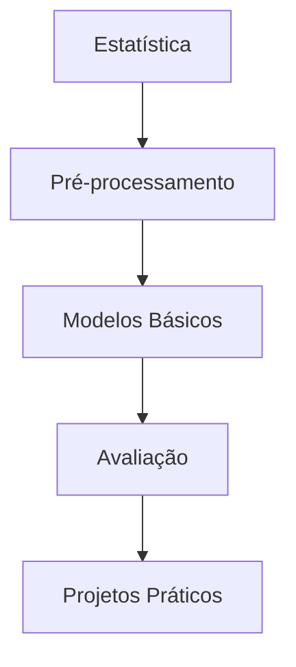

# Introdução ao Aprendizado de Máquina

Este projeto é um guia passo a passo para iniciantes em Machine Learning (ML). Aqui, você aprenderá os conceitos básicos e as ferramentas essenciais.

## Plano de Estudos

### Semana 1: Fundamentos
1. **Estatística Básica**
   - Média, mediana, desvio padrão.
   - Correlação e distribuições.
   - Testes de hipóteses.
2. **Python para ML**
   - NumPy: Arrays e operações.
   - Pandas: DataFrames e manipulação de dados.

### Semana 2: Pré-processamento
1. **Limpeza de Dados**
   - Tratamento de valores faltantes.
   - Normalização e padronização.
   - Feature engineering.
2. **Visualização**
   - Matplotlib e Seaborn.

### Semana 3: Primeiros Modelos
1. **Scikit-learn**
   - Treinamento e avaliação de modelos.
   - Regressão Linear e Árvores de Decisão.
   - K-means.
2. **Validação Cruzada**
   - Métricas: Accuracy, Precision, Recall, AUC, RMSE.

## Arquitetura do Fluxo de Aprendizado

## Ferramentas
- Python (Pandas, Scikit-learn)
- Jupyter Notebooks

## Recursos
- [Coursera: Machine Learning by Andrew Ng](https://www.coursera.org/learn/machine-learning)
- [Kaggle: Micro-cursos](https://www.kaggle.com/learn/intro-to-machine-learning)

## Próximos Passos
- Explore os notebooks na pasta `notebooks/`.
- Pratique com datasets como Iris ou Titanic.
- Explore cursos online (Coursera, Kaggle).

---
**Dúvidas?** Consulte a documentação ou abra uma issue!
