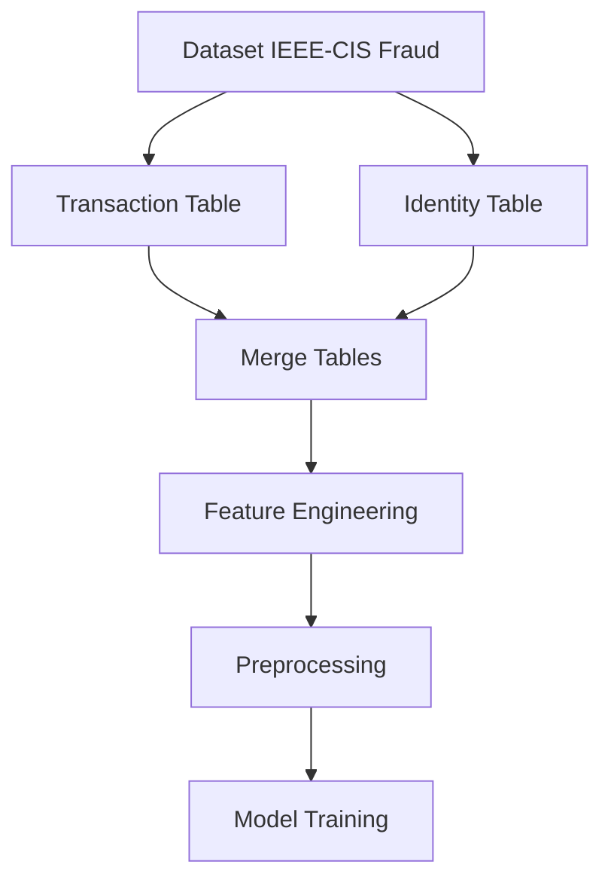
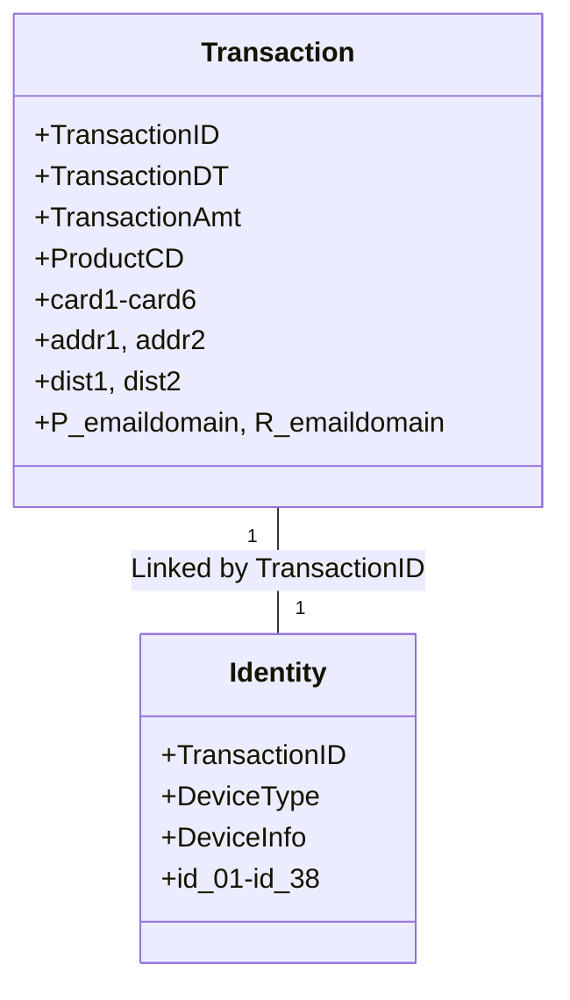

# IEEE-CIS Fraud Detection Dataset Documentation

## Overview
Este dataset é fornecido pelo IEEE Computational Intelligence Society (IEEE-CIS)  para detecção de fraudes. Ele contém dados transacionais e informações de identidade, com o objetivo de prever transações fraudulentas.

## Dataset Structure
- **train_transaction.csv**: Dados de transações para treinamento.
- **train_identity.csv**: Dados de identidade associados às transações de treinamento.
- **test_transaction.csv**: Dados de transações para teste.
- **test_identity.csv**: Dados de identidade associados às transações de teste.
- **sample_submission.csv**: Exemplo de submissão para o desafio.

## Key Tables and Relationships
- **Transaction Table**: Contém informações sobre transações (e.g., valor, horário, localização).
- **Identity Table**: Contém informações sobre dispositivos e identidades associadas às transações.
- **Relacionamento**: As tabelas são vinculadas pela coluna `TransactionID`.

## Feature Analysis
### Transaction Table
- **TransactionDT**: Timestamp da transação.
- **TransactionAmt**: Valor monetário da transação.
- **ProductCD**: Código do produto.
- **card1-card6**: Informações do cartão de crédito.
- **addr1, addr2**: Endereços associados à transação.
- **dist1, dist2**: Distâncias geográficas.
- **P_emaildomain, R_emaildomain**: Domínios de e-mail.

### Identity Table
- **DeviceType, DeviceInfo**: Informações sobre o dispositivo.
- **id_01-id_38**: Features anônimas relacionadas à identidade.

## Feature Engineering Suggestions
1. **Temporal Features**:
   - Extrair dia da semana, hora do dia, e diferença entre transações consecutivas.
2. **Aggregations**:
   - Média, desvio padrão e contagem de transações por usuário ou dispositivo.
3. **Email Features**:
   - Categorizar domínios de e-mail (e.g., gmail.com, yahoo.com).
4. **Device Features**:
   - Extrair fabricante e modelo do dispositivo.

## Data Pipeline
1. **Merge Tables**: Unir `train_transaction` e `train_identity` via `TransactionID`.
2. **Feature Engineering**: Adicionar features temporais, agregações e categorizações.
3. **Preprocessing**:
   - Tratar valores faltantes.
   - Normalizar/scale features numéricas.
   - Codificar features categóricas.

## Example Code
```python
import pandas as pd

# Load data
train_trans = pd.read_csv('data/ieee-cis-fraud/raw/train_transaction.csv')
train_id = pd.read_csv('data/ieee-cis-fraud/raw/train_identity.csv')

# Merge tables
train = pd.merge(train_trans, train_id, on='TransactionID', how='left')

# Feature engineering
train['hour'] = train['TransactionDT'] % (24 * 60 * 60) // (60 * 60)
```

## Diagrama de Fluxo de Dados





## References
- [Kaggle Competition Page](https://www.kaggle.com/c/ieee-fraud-detection)
- [IEEE-CIS Official Documentation](https://www.ieee.org/)
