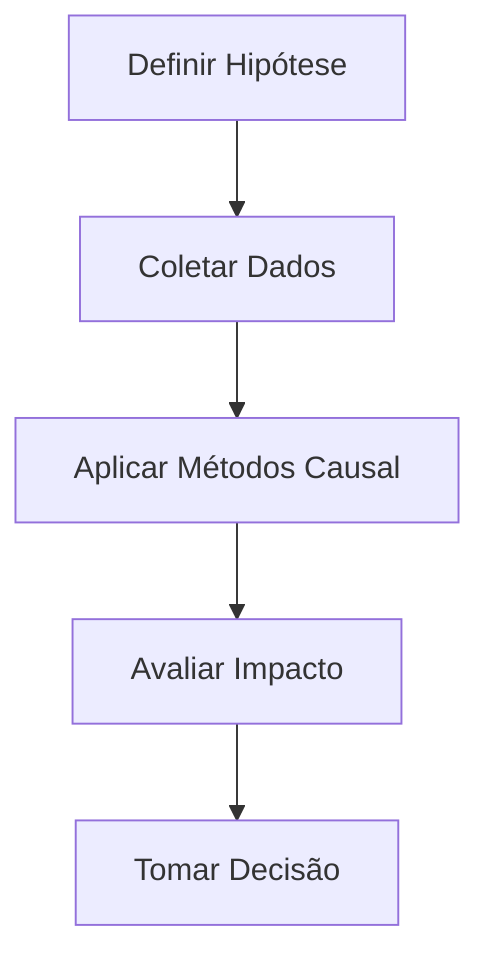

# Análise Causal

## Plano de Estudos
1. **Fundamentos de Causalidade**
   - Relação vs. causalidade, confundidores.
2. **Métodos de Inferência Causal**
   - Experimentos controlados, DoWhy, regressão descontínua.
3. **Validação de Hipóteses**
   - Testes A/B, métricas de impacto.

## Arquitetura do Fluxo Causal

## Ferramentas
- DoWhy, CausalML
- Python (Pandas, StatsModels)

## Próximos Passos
- Praticar com datasets como Lalonde ou Synthetic Controls.
- Explorar frameworks como EconML.