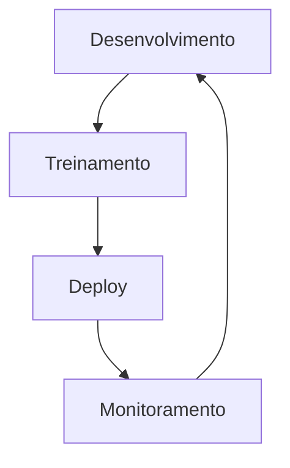

# MLOps

## Plano de Estudos
1. **Versionamento**
   - Dados, modelos (DVC, MLflow).
2. **Pipeline de CI/CD**
   - Testes automatizados, deploy (Airflow, Kubeflow).
3. **Monitoramento**
   - Drift, métricas em produção.

## Arquitetura do Fluxo MLOps

## Ferramentas
- MLflow, DVC
- Prometheus (monitoramento)

## Próximos Passos
- Praticar com projetos end-to-end.
- Explorar ferramentas como Seldon Core.